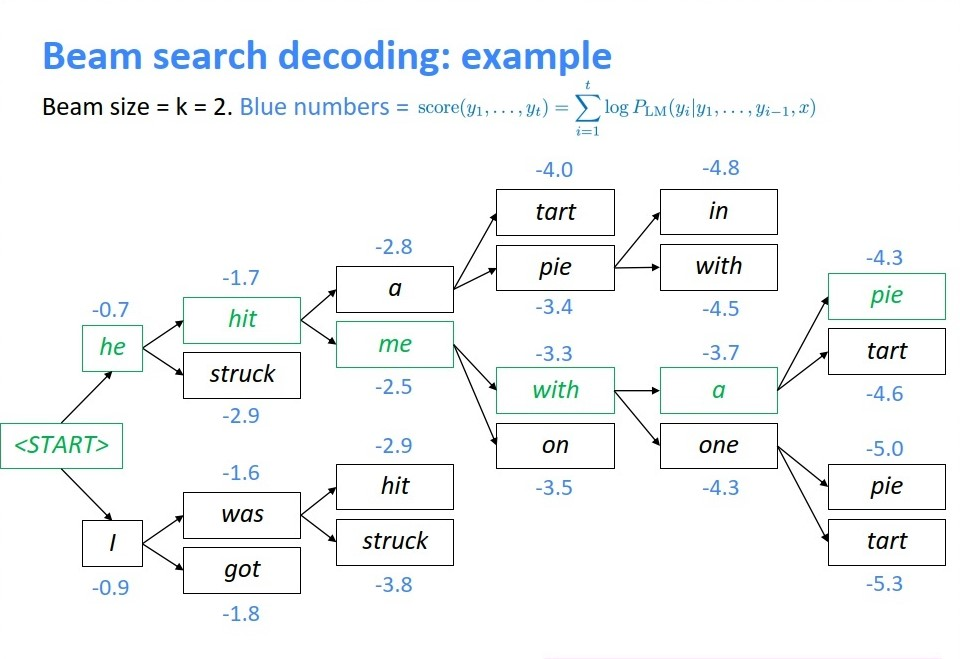
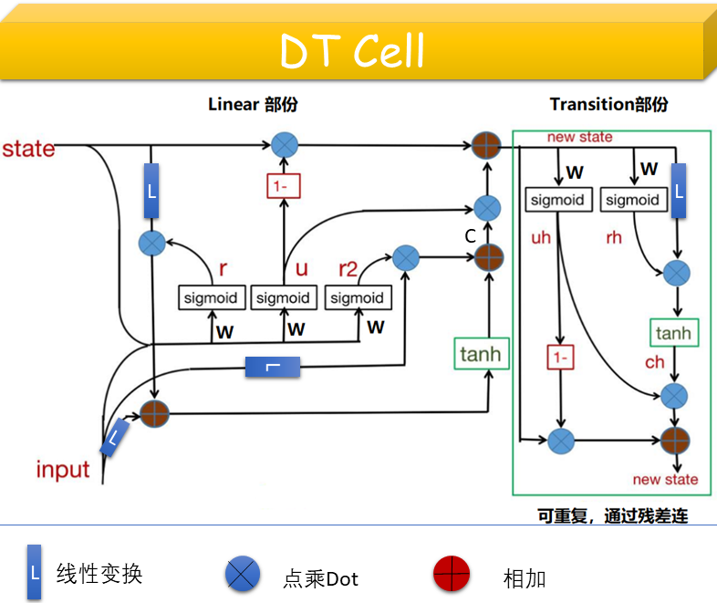

# 实验设备实体词识别/序列标注模型
>模型架构采用Seq2Seq,创新点有二：
* 先使用DT Cell 双向抽取、经过MaxPool/EveragePool得到全局表征
* 使用改进的GRU Cell  ==>  DT Cell(Deep Transition cell;来自腾讯2019) 处理时序问题更强
## 架构图

## Inference解码器：BeamSearch
* 关于BeamSearch的个人见解
> 先来说下贪心搜索。贪心搜索每一步都选择P(y|x)最大的目标，它只能保证每一步是
最优解，无法保证预测出来的句子整体是最优的。例如在T时刻贪心选择的词不是全局最优，会导致往后的所有预测词都是错误的，没有回头路了，但是穷举每个时间步骤的所有可能，时间复杂度又太高了。

> BeamSearch是贪心和穷举的一个折中方案，他在预测的每一步，都保留Top-k高概率的词作为下一步的输入。Top-K高概率不是指当前时刻，而是截止到这一时刻这条路径的累计概率之和。请注意，beam search作为一种剪枝策略，并不能保证得到全局最优解，但它能以较大的概率得到全局最优解，同时相比于穷举搜索极大的提高了搜索效率。在beam search的过程中，不同路径预测输出结束标志符<END>的时间点可能不一样，有些路径可能提前结束了，称为完全路径，暂时把这些完全路径放一边，其他路径接着beam search。beam search的停止条件有很多种，可以设置一个最大的搜索时间步数，也可以设置收集到的最多的完全路径数。

>当beam search结束时，需要从n条完全路径中选一个打分最高的路径作为最终结果。由于不同路径的长度不一样，而beam search打分是累加项，累加越多打分越低，所以需要用长度对打分进行归一化，如下图所示。那么，为什么不在beam search的过程中就直接用下面的归一化打分来比较呢？因为在树搜索的过程中，每一时刻比较的两条路径的长度是一样的，即分母是一样的，所以归一化打分和非归一化打分的大小关系是一样的，即在beam search的过程中就没必要对打分进行归一化了。

* 

## DT Cell
* 
 
class DL4MTGRULAUTransiLNCell(tf.nn.rnn_cell.RNNCell):
    """ DL4MT's implementation of GRUCell with LAU and Transition
    Args:
        num_units: int, The number of units in the RNN cell.
        reuse: (optional) Python boolean describing whether to reuse
            variables in an existing scope.  If not `True`, and the existing
            scope already has the given variables, an error is raised.
    """

    def __init__(self, num_transi, num_units, keep_prob=None, reuse=None):
        super(DL4MTGRULAUTransiLNCell, self).__init__(_reuse=reuse)
        self._num_units = num_units
        self._keep_prob = keep_prob
        self._num_transi = num_transi

    def __call__(self, inputs, state, scope=None):
        with tf.variable_scope(scope, default_name="gru_cell",
                               values=[inputs, state]):
            if not isinstance(inputs, (list, tuple)):
                inputs = [inputs]

            all_inputs = list(inputs) + [state] 
            #[batch,50]/[batch,512]/[batch,256]==>[batch,256]===>  layer_norm:(input-reduce_mean(axis=-1))/variance
            r = tf.nn.sigmoid(layer_norm(linear(all_inputs, self._num_units, False, False,
                                                scope="reset_gate"),
                                         scope="reset_gate_ln"))#[batch,256]
            r2 = tf.nn.sigmoid(layer_norm(linear(all_inputs, self._num_units, False, False,
                                                 scope="reset_gate2"),
                                          scope="reset_gate2_ln"))#[batch,256]
            u = tf.nn.sigmoid(layer_norm(linear(all_inputs, self._num_units, False, False,
                                                scope="update_gate"),
                                         scope="update_gate_ln"))#[batch,256]
            linear_state = linear(state, self._num_units, True, False, scope="linear_state")#[batch,256]
            linear_inputs = linear(inputs, self._num_units, False, False, scope="linear_inputs")#[batch,256]
            linear_inputs_transform = linear(inputs, self._num_units, False, False, scope="linear_inputs_transform")#[batch,256]
            c = tf.tanh(linear_inputs + r * linear_state) + r2 * linear_inputs_transform
            if self._keep_prob and self._keep_prob < 1.0:
                c = tf.nn.dropout(c, self._keep_prob)

            new_state = (1.0 - u) * state + u * c

        for i in range(int(self._num_transi)):
            rh = tf.nn.sigmoid(layer_norm(linear(new_state, self._num_units, False, False,
                                                 scope="trans_reset_gate_l%d" %i),
                                          scope="trans_reset_gate_ln_l%d" %i))
            uh = tf.nn.sigmoid(layer_norm(linear(new_state, self._num_units, False, False,
                                                 scope="trans_update_gate_l%d" %i),
                                          scope="trans_update_gate_ln_l%d" %i))
            ch = tf.tanh(rh * linear(new_state, self._num_units, True, False,
                                     scope="trans_candidate_l%d" %i))
            if self._keep_prob and self._keep_prob < 1.0:
                ch = tf.nn.dropout(ch, self._keep_prob)

            new_state = (1.0 - uh) * new_state + uh * ch

        return new_state, new_state#GRU输出的东西相同
